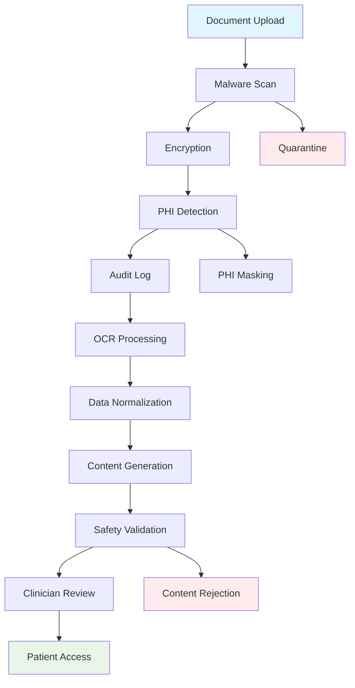

# Aivida Discharge Copilot - Architecture Design Document

## Table of Contents
1. [Executive Summary](#executive-summary)
2. [System Overview](#system-overview)
3. [HIPAA Compliance Framework](#hipaa-compliance-framework)
4. [Architecture Components](#architecture-components)
5. [Security Architecture](#security-architecture)
6. [Data Flow Architecture](#data-flow-architecture)
7. [Deployment Architecture](#deployment-architecture)
8. [Compliance and Governance](#compliance-and-governance)
9. [Implementation Roadmap](#implementation-roadmap)

## Executive Summary

The Aivida Discharge Copilot is a HIPAA-compliant, cloud-agnostic healthcare platform designed to transform complex discharge documents into patient-friendly instructions. This architecture emphasizes security-first design, data privacy, and regulatory compliance while maintaining scalability and vendor independence.

### Key Design Principles
- **HIPAA Security Rule Compliance**: Administrative, physical, and technical safeguards
- **Zero Trust Architecture**: Never trust, always verify
- **Defense in Depth**: Multiple layers of security controls
- **Cloud Agnostic**: Portable across AWS, Azure, GCP, and on-premises
- **PHI Minimization**: Limit Protected Health Information exposure
- **Audit-First**: Comprehensive logging and monitoring

## System Overview

### High-Level Architecture
```
┌─────────────────┐    ┌──────────────────┐    ┌─────────────────────┐
│   Client Tier   │────│   Service Tier   │────│   Data & Infra Tier │
│                 │    │                  │    │                     │
│ • Patient UI    │    │ • API Gateway    │    │ • Encrypted Storage │
│ • Clinician UI  │    │ • Core Services  │    │ • Secure Database   │
│ • Admin UI      │    │ • Auth/AuthZ     │    │ • Audit Logs       │
│ • Mobile Apps   │    │ • Observability  │    │ • Backup Systems   │
└─────────────────┘    └──────────────────┘    └─────────────────────┘
```

### Core Capabilities
- **Document Ingestion**: PDF, FHIR, HL7 processing with OCR
- **Content Normalization**: Medical terminology standardization
- **Patient-Friendly Generation**: AI-powered instruction creation
- **Multi-language Support**: Translation and localization
- **Appointment Management**: Calendar integration and reminders
- **Interactive Q&A**: Document-grounded conversational AI
- **Audit Trail**: Comprehensive activity logging

## HIPAA Compliance Framework

### Administrative Safeguards (45 CFR § 164.308)

#### Security Officer and Workforce Training
```yaml
Administrative Controls:
  - Security Officer: Designated HIPAA Security Officer role
  - Workforce Training: Mandatory security awareness training
  - Access Management: Role-based access control (RBAC)
  - Workforce Access: Minimum necessary access principle
  - Information Lifecycle: Data retention and disposal policies
  - Incident Response: Security incident handling procedures
  - Contingency Plan: Business continuity and disaster recovery
  - Periodic Review: Regular security assessment and updates
```

#### Access Control Matrix
| Role | Patient Data | Clinical Data | Admin Functions | Audit Logs |
|------|-------------|---------------|----------------|------------|
| Patient | Own Only | None | None | Own Only |
| Clinician | Assigned Patients | Read/Write | Limited | Own Actions |
| Admin | Aggregated/De-identified | None | Full | Read Only |
| System Admin | None | None | System Config | Read Only |
| Auditor | None | None | None | Read Only |

### Physical Safeguards (45 CFR § 164.310)

#### Infrastructure Security
```yaml
Physical Controls:
  - Facility Access: Multi-factor authentication for data centers
  - Workstation Use: Secure workstation configuration
  - Device Controls: Mobile device management (MDM)
  - Media Controls: Encrypted storage and secure disposal
  - Data Center: SOC 2 Type II certified facilities
  - Network Infrastructure: Segregated network architecture
```

### Technical Safeguards (45 CFR § 164.312)

#### Security Controls Implementation
```yaml
Technical Controls:
  - Access Control: Multi-factor authentication (MFA)
  - Audit Controls: Comprehensive logging and monitoring
  - Integrity: Data integrity verification and checksums
  - Transmission Security: End-to-end encryption (TLS 1.3+)
  - Encryption: AES-256 encryption at rest and in transit
  - Authentication: Strong password policies and SSO
  - Automatic Logoff: Session timeout and idle logout
  - Unique User Identification: Individual user accounts
```

## Architecture Components

### 1. Client Tier

#### Web Applications
```typescript
// Example: Secure React Component with HIPAA considerations
interface SecureComponentProps {
  patientId: string;
  sessionToken: string;
  auditLogger: AuditLogger;
}

const PatientDashboard: React.FC<SecureComponentProps> = ({
  patientId,
  sessionToken,
  auditLogger
}) => {
  // PHI display with audit logging
  const [patientData, setPatientData] = useState<PatientData | null>(null);
  
  useEffect(() => {
    // Log access attempt
    auditLogger.logAccess({
      userId: getCurrentUser().id,
      resourceType: 'patient_dashboard',
      resourceId: patientId,
      action: 'view',
      timestamp: new Date().toISOString()
    });
  }, []);

  // Auto-logout on inactivity
  useIdleTimer({
    timeout: 15 * 60 * 1000, // 15 minutes
    onIdle: () => {
      auditLogger.logLogout({ reason: 'idle_timeout' });
      authService.logout();
    }
  });

  return (
    <SecureContainer>
      {/* Patient data display with watermarking */}
    </SecureContainer>
  );
};
```

#### Mobile Applications
- **iOS/Android**: Native apps with biometric authentication
- **Progressive Web App**: Offline capabilities with encrypted local storage
- **Accessibility**: WCAG 2.1 AA compliance for inclusive design

### 2. Service Tier

#### API Gateway
```yaml
API Gateway Configuration:
  Authentication:
    - OAuth 2.0 / OpenID Connect
    - JWT token validation
    - API key management
  
  Rate Limiting:
    - Per-user limits: 1000 requests/hour
    - Per-endpoint limits: Variable based on operation
    - DDoS protection: Automated traffic analysis
  
  Request/Response:
    - Request validation: JSON schema validation
    - Response filtering: PHI data masking
    - Content transformation: Data format conversion
  
  Security Headers:
    - HSTS: Strict-Transport-Security
    - CSP: Content-Security-Policy
    - X-Frame-Options: DENY
    - X-Content-Type-Options: nosniff
```

#### Core Microservices

##### Ingestion Service
```python
# Example: HIPAA-compliant document ingestion
from cryptography.fernet import Fernet
from audit_logger import AuditLogger
import hashlib

class DocumentIngestionService:
    def __init__(self, encryption_key: bytes, audit_logger: AuditLogger):
        self.cipher = Fernet(encryption_key)
        self.audit_logger = audit_logger
    
    async def ingest_document(self, document: bytes, metadata: dict) -> str:
        """
        Securely ingest and process medical documents
        """
        # Generate document hash for integrity verification
        doc_hash = hashlib.sha256(document).hexdigest()
        
        # Encrypt document before storage
        encrypted_doc = self.cipher.encrypt(document)
        
        # Log ingestion activity
        self.audit_logger.log_event({
            'event_type': 'document_ingestion',
            'document_hash': doc_hash,
            'user_id': metadata.get('user_id'),
            'patient_id': metadata.get('patient_id'),
            'timestamp': datetime.utcnow().isoformat(),
            'source_ip': metadata.get('source_ip')
        })
        
        # Store encrypted document
        document_id = await self.store_encrypted_document(
            encrypted_doc, doc_hash, metadata
        )
        
        # Queue for processing
        await self.queue_for_processing(document_id, metadata)
        
        return document_id
```

##### Normalization Service
```python
class MedicalDataNormalizer:
    """
    Normalize medical data while maintaining HIPAA compliance
    """
    
    def __init__(self, audit_logger: AuditLogger):
        self.audit_logger = audit_logger
        self.rxnorm_mapper = RxNormMapper()
        self.snomed_mapper = SnomedMapper()
    
    async def normalize_medications(self, raw_meds: List[dict], 
                                  patient_id: str) -> List[NormalizedMedication]:
        """
        Normalize medication data with audit trail
        """
        normalized_meds = []
        
        for med in raw_meds:
            # Normalize to RxNorm
            normalized_med = await self.rxnorm_mapper.normalize(med)
            
            # Log normalization activity (without PHI)
            self.audit_logger.log_event({
                'event_type': 'medication_normalization',
                'patient_id_hash': hashlib.sha256(patient_id.encode()).hexdigest(),
                'original_format': med.get('format'),
                'normalized_code': normalized_med.rxnorm_code,
                'timestamp': datetime.utcnow().isoformat()
            })
            
            normalized_meds.append(normalized_med)
        
        return normalized_meds
```

##### Generation Service
```python
class PatientInstructionGenerator:
    """
    Generate patient-friendly instructions with safety guardrails
    """
    
    def __init__(self, llm_client: LLMClient, audit_logger: AuditLogger):
        self.llm_client = llm_client
        self.audit_logger = audit_logger
        self.safety_filter = SafetyContentFilter()
    
    async def generate_instructions(self, normalized_data: dict, 
                                  patient_context: PatientContext) -> str:
        """
        Generate patient instructions with safety checks
        """
        # Apply safety filters to input
        filtered_data = await self.safety_filter.filter_input(normalized_data)
        
        # Generate instructions using grounded prompting
        prompt = self.build_grounded_prompt(filtered_data, patient_context)
        
        # Call LLM with audit logging
        self.audit_logger.log_event({
            'event_type': 'llm_generation_request',
            'patient_id_hash': hashlib.sha256(
                patient_context.patient_id.encode()
            ).hexdigest(),
            'prompt_hash': hashlib.sha256(prompt.encode()).hexdigest(),
            'timestamp': datetime.utcnow().isoformat()
        })
        
        generated_content = await self.llm_client.generate(prompt)
        
        # Apply safety filters to output
        safe_content = await self.safety_filter.filter_output(generated_content)
        
        # Validate medical accuracy
        validation_result = await self.validate_medical_content(safe_content)
        
        if not validation_result.is_safe:
            raise MedicalSafetyException(validation_result.issues)
        
        return safe_content
```

##### Authentication & Authorization Service
```python
class HIPAAAuthService:
    """
    HIPAA-compliant authentication and authorization service
    """
    
    def __init__(self, audit_logger: AuditLogger):
        self.audit_logger = audit_logger
        self.session_manager = SecureSessionManager()
        self.mfa_service = MFAService()
    
    async def authenticate_user(self, credentials: UserCredentials, 
                              request_info: RequestInfo) -> AuthResult:
        """
        Multi-factor authentication with audit logging
        """
        # Log authentication attempt
        self.audit_logger.log_event({
            'event_type': 'authentication_attempt',
            'username': credentials.username,
            'source_ip': request_info.source_ip,
            'user_agent': request_info.user_agent,
            'timestamp': datetime.utcnow().isoformat()
        })
        
        # Validate primary credentials
        primary_auth = await self.validate_primary_auth(credentials)
        if not primary_auth.success:
            await self.handle_failed_auth(credentials.username, request_info)
            return AuthResult(success=False, reason='invalid_credentials')
        
        # Require MFA for PHI access
        if self.requires_mfa(credentials.username):
            mfa_result = await self.mfa_service.verify(credentials.mfa_token)
            if not mfa_result.success:
                return AuthResult(success=False, reason='mfa_failed')
        
        # Create secure session
        session = await self.session_manager.create_session(
            user_id=primary_auth.user_id,
            roles=primary_auth.roles,
            session_timeout=datetime.utcnow() + timedelta(minutes=15)
        )
        
        # Log successful authentication
        self.audit_logger.log_event({
            'event_type': 'authentication_success',
            'user_id': primary_auth.user_id,
            'session_id': session.session_id,
            'source_ip': request_info.source_ip,
            'timestamp': datetime.utcnow().isoformat()
        })
        
        return AuthResult(
            success=True,
            session=session,
            user=primary_auth.user
        )
```

### 3. Data & Infrastructure Tier

#### Database Architecture
```sql
-- Example: HIPAA-compliant database schema design

-- Patient table with encryption
CREATE TABLE patients (
    patient_id UUID PRIMARY KEY DEFAULT gen_random_uuid(),
    encrypted_pii BYTEA NOT NULL, -- Encrypted PII data
    pii_hash VARCHAR(64) NOT NULL, -- Hash for duplicate detection
    created_at TIMESTAMP WITH TIME ZONE DEFAULT NOW(),
    updated_at TIMESTAMP WITH TIME ZONE DEFAULT NOW(),
    
    -- Audit fields
    created_by UUID NOT NULL,
    last_accessed_at TIMESTAMP WITH TIME ZONE,
    access_count INTEGER DEFAULT 0
);

-- Create index on hash for efficient lookups without exposing PII
CREATE INDEX idx_patients_pii_hash ON patients(pii_hash);

-- Discharge episodes
CREATE TABLE discharge_episodes (
    episode_id UUID PRIMARY KEY DEFAULT gen_random_uuid(),
    patient_id UUID NOT NULL REFERENCES patients(patient_id),
    original_document_id UUID NOT NULL,
    normalized_data JSONB NOT NULL,
    generated_instructions TEXT,
    status VARCHAR(20) NOT NULL DEFAULT 'pending',
    approved_by UUID,
    approved_at TIMESTAMP WITH TIME ZONE,
    
    -- HIPAA compliance fields
    phi_accessed_by UUID[],
    phi_access_log JSONB,
    retention_date TIMESTAMP WITH TIME ZONE,
    
    created_at TIMESTAMP WITH TIME ZONE DEFAULT NOW(),
    updated_at TIMESTAMP WITH TIME ZONE DEFAULT NOW()
);

-- Audit trail table
CREATE TABLE audit_events (
    event_id UUID PRIMARY KEY DEFAULT gen_random_uuid(),
    event_type VARCHAR(50) NOT NULL,
    user_id UUID,
    resource_type VARCHAR(50),
    resource_id UUID,
    action VARCHAR(50) NOT NULL,
    timestamp TIMESTAMP WITH TIME ZONE DEFAULT NOW(),
    source_ip INET,
    user_agent TEXT,
    event_data JSONB,
    
    -- Retention and compliance
    retention_category VARCHAR(20) NOT NULL DEFAULT 'standard',
    purge_date TIMESTAMP WITH TIME ZONE
);

-- Index for efficient audit queries
CREATE INDEX idx_audit_events_timestamp ON audit_events(timestamp);
CREATE INDEX idx_audit_events_user_action ON audit_events(user_id, action);
CREATE INDEX idx_audit_events_resource ON audit_events(resource_type, resource_id);
```

#### Storage Architecture
```yaml
Storage Strategy:
  Primary Storage:
    Type: PostgreSQL with TDE (Transparent Data Encryption)
    Encryption: AES-256-GCM
    Backup: Encrypted automated backups every 4 hours
    Retention: 7 years for audit logs, 3 years for patient data
  
  Object Storage:
    Type: S3-compatible with SSE-KMS
    Encryption: Customer-managed keys (CMK)
    Access: Pre-signed URLs with time-limited access
    Lifecycle: Automated archival after 1 year
  
  Search Index:
    Type: OpenSearch with encryption
    Data: De-identified/tokenized content only
    Scope: Episode-specific search boundaries
  
  Caching:
    Type: Redis with encryption
    TTL: Maximum 15 minutes for PHI
    Scope: User-specific cache isolation
```

## Security Architecture

### Zero Trust Network Architecture
```
┌─────────────────────────────────────────────────────────────┐
│                    Zero Trust Boundary                      │
│                                                             │
│  ┌──────────────┐    ┌──────────────┐    ┌──────────────┐  │
│  │   Identity   │    │   Network    │    │   Device     │  │
│  │ Verification │    │ Segmentation │    │ Attestation  │  │
│  └──────────────┘    └──────────────┘    └──────────────┘  │
│                                                             │
│  ┌─────────────────────────────────────────────────────────┤
│  │                Application Layer                         │
│  │  ┌─────────────┐ ┌─────────────┐ ┌─────────────┐       │
│  │  │  API GW     │ │ Core Svcs   │ │ Data Layer  │       │
│  │  │ (mTLS + JWT)│ │(Service Mesh│ │(Encrypted)  │       │
│  │  └─────────────┘ └─────────────┘ └─────────────┘       │
│  └─────────────────────────────────────────────────────────┤
└─────────────────────────────────────────────────────────────┘
```

### Encryption Strategy
```yaml
Encryption at Rest:
  Database: AES-256-GCM with customer-managed keys
  Object Storage: SSE-KMS with key rotation every 90 days
  Application Secrets: HashiCorp Vault or equivalent
  Backup Storage: Additional encryption layer with separate keys

Encryption in Transit:
  External: TLS 1.3 with perfect forward secrecy
  Internal: mTLS with certificate rotation every 30 days
  Message Queue: End-to-end encryption with service-specific keys
  Database Connections: SSL/TLS with certificate pinning

Key Management:
  Key Hierarchy: Master keys → Data encryption keys → Field-level keys
  Rotation Schedule: Automatic rotation based on usage and time
  Access Control: HSM-backed keys with role-based access
  Audit Trail: Complete key usage and access logging
```

### Network Security
```yaml
Network Segmentation:
  DMZ Zone: API Gateway and load balancers
  Application Zone: Core services and business logic
  Data Zone: Databases and storage systems
  Management Zone: Monitoring and administrative tools

Firewall Rules:
  Ingress: Only HTTPS (443) and management (SSH/RDP on non-standard ports)
  Egress: Restricted to necessary external services only
  Inter-Zone: Explicit allow rules with logging
  Default: Deny all with comprehensive logging

DDoS Protection:
  Layer 3/4: Cloud provider DDoS protection
  Layer 7: Application-level rate limiting and WAF
  Monitoring: Real-time traffic analysis and alerting
```

## Data Flow Architecture

### Secure Data Processing Pipeline


### Data Retention and Lifecycle
```yaml
Data Retention Policy:
  Patient Data:
    Active: 3 years from last access
    Archived: 7 years total (HIPAA minimum)
    Deletion: Secure cryptographic erasure
  
  Audit Logs:
    Real-time: 90 days in hot storage
    Archive: 7 years in encrypted cold storage
    Legal Hold: Indefinite retention when required
  
  Generated Content:
    Instructions: Same as patient data lifecycle
    Chat History: 1 year with patient consent
    Analytics: De-identified aggregation only
  
  Backup Data:
    Frequency: Every 4 hours for critical data
    Retention: 30 days for operational recovery
    Testing: Monthly restore verification
    Encryption: Separate key hierarchy from production
```

## Deployment Architecture

### Kubernetes-Based Deployment
```yaml
# Example: HIPAA-compliant Kubernetes deployment
apiVersion: apps/v1
kind: Deployment
metadata:
  name: ingestion-service
  namespace: aivida-production
  labels:
    app: ingestion-service
    compliance: hipaa
spec:
  replicas: 3
  selector:
    matchLabels:
      app: ingestion-service
  template:
    metadata:
      labels:
        app: ingestion-service
        compliance: hipaa
      annotations:
        # Security annotations
        seccomp.security.alpha.kubernetes.io/pod: runtime/default
        apparmor.security.beta.kubernetes.io/pod: runtime/default
    spec:
      # Security context for HIPAA compliance
      securityContext:
        runAsNonRoot: true
        runAsUser: 65534
        fsGroup: 65534
        seccompProfile:
          type: RuntimeDefault
      
      # Service account with minimal permissions
      serviceAccountName: ingestion-service-sa
      
      containers:
      - name: ingestion-service
        image: aivida/ingestion-service:v1.0.0
        imagePullPolicy: Always
        
        # Container security context
        securityContext:
          allowPrivilegeEscalation: false
          capabilities:
            drop:
            - ALL
          readOnlyRootFilesystem: true
          runAsNonRoot: true
          runAsUser: 65534
        
        # Resource limits for stability
        resources:
          requests:
            memory: "512Mi"
            cpu: "250m"
          limits:
            memory: "1Gi"
            cpu: "500m"
        
        # Environment variables from secrets
        envFrom:
        - secretRef:
            name: ingestion-service-secrets
        
        # Health checks
        livenessProbe:
          httpGet:
            path: /health
            port: 8080
            scheme: HTTPS
          initialDelaySeconds: 30
          periodSeconds: 10
        
        readinessProbe:
          httpGet:
            path: /ready
            port: 8080
            scheme: HTTPS
          initialDelaySeconds: 5
          periodSeconds: 5
        
        # Volume mounts for temporary storage
        volumeMounts:
        - name: temp-storage
          mountPath: /tmp
        - name: config
          mountPath: /etc/config
          readOnly: true
      
      volumes:
      - name: temp-storage
        emptyDir:
          sizeLimit: 1Gi
      - name: config
        configMap:
          name: ingestion-service-config
      
      # Network policy for micro-segmentation
      tolerations:
      - key: "hipaa-compliant"
        operator: "Equal"
        value: "true"
        effect: "NoSchedule"
```

### Cloud-Agnostic Infrastructure as Code
```terraform
# Example: Terraform configuration for HIPAA-compliant infrastructure

# Provider-agnostic variables
variable "cloud_provider" {
  description = "Target cloud provider (aws, azure, gcp)"
  type        = string
  validation {
    condition     = contains(["aws", "azure", "gcp"], var.cloud_provider)
    error_message = "Cloud provider must be aws, azure, or gcp."
  }
}

# Encryption key management
resource "random_password" "encryption_key" {
  length  = 32
  special = true
}

# Database with encryption
module "database" {
  source = "./modules/database"
  
  cloud_provider    = var.cloud_provider
  encryption_key    = random_password.encryption_key.result
  backup_retention  = 7 # days
  
  # HIPAA compliance settings
  enable_audit_logging = true
  force_ssl           = true
  deletion_protection = true
  
  tags = {
    Environment = "production"
    Compliance  = "hipaa"
    DataClass   = "phi"
  }
}

# Object storage with encryption
module "object_storage" {
  source = "./modules/object_storage"
  
  cloud_provider = var.cloud_provider
  
  # Encryption configuration
  kms_key_rotation_days = 90
  versioning_enabled    = true
  lifecycle_rules = {
    archive_after_days = 365
    delete_after_days  = 2555 # 7 years
  }
  
  # Access controls
  public_access_blocked = true
  ssl_requests_only     = true
  
  tags = {
    Environment = "production"
    Compliance  = "hipaa"
    DataClass   = "phi"
  }
}

# Kubernetes cluster with security hardening
module "kubernetes" {
  source = "./modules/kubernetes"
  
  cloud_provider = var.cloud_provider
  
  # Security settings
  enable_pod_security_policy = true
  enable_network_policy      = true
  enable_secrets_encryption  = true
  
  # RBAC configuration
  enable_rbac = true
  
  # Audit logging
  audit_log_maxage    = 30
  audit_log_maxbackup = 10
  audit_log_maxsize   = 100
  
  node_pools = {
    hipaa_compliant = {
      instance_type = "c5.large"
      min_size      = 3
      max_size      = 10
      
      # Security groups
      security_groups = [module.security_groups.hipaa_nodes.id]
      
      # Encryption
      encrypted_storage = true
      
      # Compliance taints
      taints = [
        {
          key    = "hipaa-compliant"
          value  = "true"
          effect = "NoSchedule"
        }
      ]
    }
  }
}

# Security monitoring
module "security_monitoring" {
  source = "./modules/security_monitoring"
  
  cloud_provider = var.cloud_provider
  
  # SIEM integration
  enable_siem_export = true
  
  # Compliance monitoring
  compliance_frameworks = ["hipaa", "sox"]
  
  # Alerting
  alert_channels = [
    module.notifications.security_team_channel,
    module.notifications.compliance_team_channel
  ]
  
  # Retention
  log_retention_days = 2555 # 7 years
}
```

## Compliance and Governance

### Business Associate Agreements (BAA)
```yaml
BAA Requirements:
  Cloud Providers:
    - Signed HIPAA BAA with primary cloud provider
    - Data processing addendum for EU operations
    - Incident notification requirements (< 24 hours)
  
  Third-Party Services:
    - LLM Providers: BAA required for any PHI processing
    - OCR Services: BAA and data residency guarantees
    - Translation Services: De-identified data only
    - Monitoring Tools: PHI-free metrics and logging
  
  Subcontractors:
    - Development Partners: Limited access with BAA
    - Support Vendors: No PHI access without BAA
    - Audit Firms: Explicit audit rights in BAA
```

### Risk Assessment and Management
```yaml
Risk Assessment Framework:
  Frequency: Annual comprehensive, quarterly updates
  
  Key Risk Areas:
    - Data Breach: Encryption, access controls, monitoring
    - Insider Threats: Background checks, access logging
    - Technical Failures: Redundancy, backup, recovery
    - Compliance Violations: Training, auditing, monitoring
  
  Risk Mitigation:
    High Risk: Immediate action required
    Medium Risk: Mitigation plan within 30 days
    Low Risk: Quarterly review and monitoring
  
  Documentation:
    - Risk register with severity scoring
    - Mitigation strategies and timelines
    - Regular review and update process
    - Incident correlation and trending
```

### Audit and Monitoring Framework
```yaml
Continuous Monitoring:
  Security Events:
    - Failed authentication attempts
    - Unusual data access patterns
    - Privilege escalation attempts
    - Data export/download activities
  
  Compliance Events:
    - PHI access outside normal hours
    - Bulk data operations
    - Configuration changes
    - User permission modifications
  
  Performance Monitoring:
    - System availability and response times
    - Data processing pipeline health
    - Encryption key rotation status
    - Backup and recovery verification

Audit Trail Requirements:
  Data Elements:
    - User identification (unique ID)
    - Timestamp with timezone
    - Action performed
    - Resource accessed
    - Source IP address
    - Session identifier
    - Result (success/failure)
  
  Retention: 7 years minimum
  Integrity: Cryptographic signatures
  Access: Read-only for auditors
  Export: Standard formats (CSV, JSON, SYSLOG)
```

### Incident Response Plan
```yaml
Incident Classification:
  Level 1 - Critical: Confirmed PHI breach or system compromise
  Level 2 - High: Suspected breach or significant system issue
  Level 3 - Medium: Security event requiring investigation
  Level 4 - Low: Policy violation or minor security issue

Response Timeline:
  Detection: Automated monitoring with 5-minute alerting
  Assessment: Initial triage within 15 minutes
  Containment: Isolation measures within 1 hour
  Investigation: Detailed analysis within 24 hours
  Notification: Regulatory reporting within 72 hours
  Recovery: Service restoration with security validation

Response Team:
  - Incident Commander: Overall response coordination
  - Security Lead: Technical investigation and containment
  - Legal Counsel: Regulatory and legal implications
  - Communications: Internal and external notifications
  - Clinical Lead: Patient safety and clinical impact
```

## Implementation Roadmap

### Phase 1: Foundation (Months 1-3)
```yaml
Infrastructure Setup:
  - Cloud account setup with HIPAA configuration
  - Basic Kubernetes cluster deployment
  - Database with encryption and backup
  - Initial security monitoring and logging
  - Basic CI/CD pipeline with security scanning

Core Services Development:
  - Authentication and authorization service
  - Basic audit logging framework
  - Document ingestion with encryption
  - Initial API gateway with rate limiting

Compliance Framework:
  - Security policies and procedures
  - Initial risk assessment
  - Staff security training program
  - Vendor BAA collection and review
```

### Phase 2: Core Platform (Months 4-6)
```yaml
Service Implementation:
  - PDF processing and OCR integration
  - Medical data normalization service
  - Basic instruction generation (non-AI)
  - Patient and clinician portal MVPs
  - Comprehensive audit trail implementation

Security Hardening:
  - Zero trust network implementation
  - Advanced threat detection
  - Encryption key management system
  - Security incident response procedures
  - Penetration testing and remediation

Compliance Validation:
  - HIPAA security rule compliance audit
  - Third-party security assessment
  - Compliance documentation completion
  - Incident response plan testing
```

### Phase 3: AI Integration (Months 7-9)
```yaml
AI/ML Services:
  - LLM integration with safety guardrails
  - Grounded content generation
  - Multi-language translation support
  - Conversational Q&A implementation
  - Advanced content safety filters

Enhanced Features:
  - Real-time chat with document grounding
  - Appointment calendar integration
  - Mobile application deployment
  - Advanced analytics and reporting
  - Patient preference management

Advanced Security:
  - ML-based anomaly detection
  - Advanced persistent threat protection
  - Behavioral analysis and alerting
  - Automated compliance monitoring
  - Enhanced audit analytics
```

### Phase 4: Production Deployment (Months 10-12)
```yaml
Production Readiness:
  - Load testing and performance optimization
  - Disaster recovery testing and validation
  - Final security and compliance audits
  - Production monitoring and alerting
  - Change management procedures

Go-Live Preparation:
  - Staff training and certification
  - Pilot deployment with select users
  - Production data migration and validation
  - Customer support procedures
  - Ongoing maintenance and support plans

Continuous Improvement:
  - Post-deployment monitoring and optimization
  - User feedback integration
  - Security posture continuous improvement
  - Compliance framework maturation
  - Roadmap for next phase features
```

## Conclusion

This architecture design provides a comprehensive, HIPAA-compliant foundation for the Aivida Discharge Copilot platform. The design emphasizes security-first principles, regulatory compliance, and operational excellence while maintaining the flexibility to deploy across multiple cloud providers.

Key architectural decisions prioritize:
- **Patient data protection** through defense-in-depth security
- **Regulatory compliance** with comprehensive audit trails
- **Operational resilience** through redundancy and monitoring
- **Vendor independence** through cloud-agnostic design
- **Scalable growth** through microservices architecture

The implementation roadmap provides a structured approach to deployment while ensuring compliance requirements are met at each phase. Regular security assessments, compliance audits, and continuous monitoring will ensure the platform maintains its security posture and regulatory compliance throughout its operational lifecycle.
